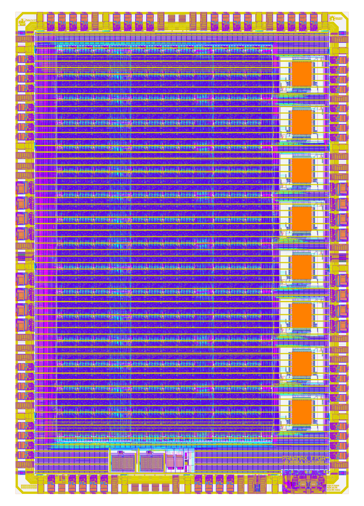

# Panamax FPGA

A FABulous FPGA utilizing the Panamax padframe designed using open source EDA tools and the open source sky130 PDK.

<p align="center">
  <a href="img/panamax_fpga.png">
    
  </a>
</p>

## Feature Overview

- 64 I/Os
    * Pull-up / Pull-down
    * Open-drain
    * Slow / fast slew
- 1280 LCs (LUT4 + FF)
- 8 MAC
- 16 Register files (32x4 1w2r)
- 8 BRAM (dual-ported 1r1rw, 256x32)
- 2 x 12-bit split CDAC SAR-ADC
- 2 x 8-bit R-DAC

## FPGA Fabric


## FPGA Configuration


## Building the Core

Note, you will need my [OpenLane 2 branch](https://github.com/mole99/openlane2/tree/ihp) to build the chip.

```
make pnr
```

## Finishing Steps

```
make copy-macro
make lvs
make merge
make create-image
make drc
make fill
make drc-fill
```